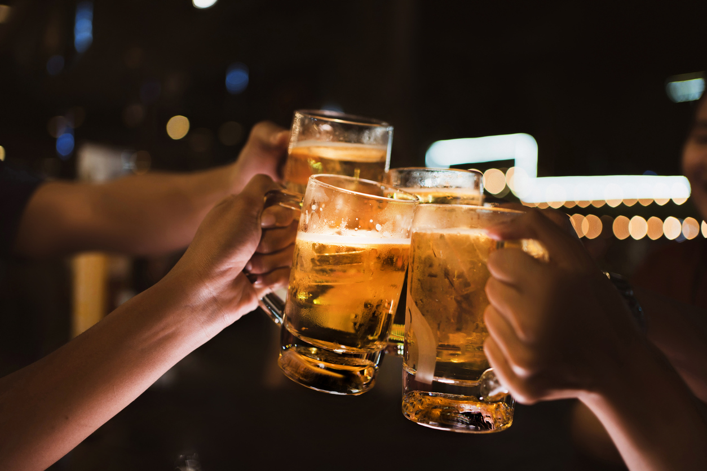

# Portfolio Analista de dados

  

## Sobre mim

  

  

Meu nome é Marcos Gabriel Miranda Flor, sou formado em Análise e Desenvolvimento de Sistemas sou amante de tecnonologia e tenho conhecimento em uma grande variedade de tecnologias para saber mais informações da minha jornada pode ser encontrada, [Meu Linkedin](https://www.linkedin.com/in/marcos-gabriel-miranda-flor-1ba526170/), [Currículo](https://docs.google.com/document/d/1BkUhr98SZ4WFlJt3aQ8DXDqPlJhmINwB/edit?usp=share_link&ouid=110317353623796145294&rtpof=true&sd=true).

  

  

## Projetos

  

  

Esta é uma lista de alguns projetos de aprendizado de máquina em que trabalhei ou estou trabalhando atualmente. É atualizado regularmente. Clique nos projetos para ver a analisar os códigos completos.

  

---

  
  

### 1. [Projeto: Análise e Previsão de valores imobiliários ](https://github.com/Gabrieldevelopermax/analise-e-previsao-de-valores-imobiliarios) :house:

  

  

  

  

O mercado imobiliário vem sendo objeto de diversos estudos e pesquisas nos últimos tempos. A crise financeira que afeta a economia tem afetado significativamente os investimentos e ganhos advindos deste setor. Este cenário incentiva o aumento do interesse por estudos de previsão de demanda baseados em características deste mercado, dos imóveis e do entorno destes imóveis.

  

  

Neste contexto o objetivo principal do nosso projeto é desenvolver um sistema de avaliação imobiliária utilizando a metodologia de regressões lineares que é uma das técnicas de machine learning.

  

  

## Bibliotecas utilizadas

  

Pandas | Seaborn | Numpy | Sklearn | Statsmodels

  

  

## Dataset

  

Valor - Valor (R$) de oferta do imóvel

  

Area - Área do imóvel em m²

  

Dist_Praia - Distância do imóvel até a praia (km) (em linha reta)

  

Dist_Farmacia - Distância do imóvel até a farmácia mais próxima (km) (em linha reta)

  

---

  

### 2. [ Previsão de Consumo de Cerveja Análise e Projeções para o Mercado Cervejeiro ](https://github.com/Gabrieldevelopermax/Data-Science-Portfolio/tree/main/Projeto%202%20-%20Previs%C3%A3o%20de%20Consumo%20de%20Cerveja%20Analise%20e%20Projecoes%20para%20o%20Mercado%20Cervejeiro) :beer:

  

  

  

  

A cerveja é uma bebida amplamente democrática e consumida globalmente. É ideal para quase todas as ocasiões, desde happy hours até grandes festas de casamento.

  

O objetivo deste projeto é usar a técnica de Regressão Linear em Aprendizado de Máquina para identificar o impacto das variáveis disponíveis no dataset sobre o consumo de cerveja (Y). Ao final, teremos um algoritmo que pode prever o consumo de cerveja.

  

Os dados (amostra) foram coletados em São Paulo - Brasil, em uma área universitária, onde existem algumas festas com grupos de alunos de 18 a 28 anos de idade (média).

  

Fonte: https://www.kaggle.com/datasets/dongeorge/beer-consumption-sao-paulo.

  

  

## Bibliotecas utilizadas

  

Pandas | Seaborn | Numpy | Sklearn | Matplotlib | Seaborn | Salmoura

  

  
  

## Conjunto de dados

  
  
  

dados - dados

  

temp_media - Temperatura Média (°C)

  

temp_min - Temperatura Mínima (°C)

  

temp_max - Temperatura Máxima (°C)

  

chuva - Precipitação (mm)

  

fds - Final de Semana (1 = Sim; 0 = Não)

  

consumo - Consumo de Cerveja (litros)

---

  

### 3. [ Detecção de Fraudes em Transações com Cartão de Crédito ](https://github.com/Gabrieldevelopermax/Data-Science-Portfolio/tree/main/Projeto%203-%20Detec%C3%A7%C3%A3o%20de%20Fraudes%20em%20Transa%C3%A7%C3%B5es%20com%20Cart%C3%A3o%20de%20Cr%C3%A9dito) :credit_card:

  

  

É importante que as empresas de cartão de crédito sejam capazes de reconhecer transações fraudulentas com cartão de crédito para que os clientes não sejam cobrados por itens que não compraram.

O conjunto de dados contém transações feitas por cartões de crédito em setembro de 2013 por titulares de cartões europeus.  
Este conjunto de dados apresenta transações ocorridas em dois dias, onde temos 492 fraudes em 284.807 transações. O conjunto de dados é altamente desbalanceado, a classe positiva (fraudes) responde por 0,172% de todas as transações.

Ele contém apenas variáveis ​​de entrada numéricas que são o resultado de uma transformação PCA. Infelizmente, devido a questões de confidencialidade, não podemos fornecer os recursos originais e mais informações básicas sobre os dados. As características V1, V2, … V28 são os principais componentes obtidos com PCA, as únicas características que não foram transformadas com PCA são 'Time' e 'Amount'. O recurso 'Tempo' contém os segundos decorridos entre cada transação e a primeira transação no conjunto de dados. O recurso 'Valor' é o valor da transação, esse recurso pode ser usado para aprendizado sensível ao custo dependente de exemplo. A característica 'Classe' é a variável de resposta e assume valor 1 em caso de fraude e 0 caso contrário.

Dada a taxa de desequilíbrio de classe, recomendamos medir a precisão usando a Área sob a Curva de Rechamada de Precisão (AUPRC). A precisão da matriz de confusão não é significativa para a classificação desbalanceada.

  

Fonte: https://www.kaggle.com/datasets/mlg-ulb/creditcardfraud

  

  

## Bibliotecas utilizadas

  

Pandas | Numpy | Sklearn | Matplotlib

  

  
  

## Conjunto de dados

  
Amount - Valor da transação

Time- Número de segundos decorridos entre esta transação e a primeira transação no conjunto de dados

Class- 1 (fraude) - 0 (Verdadeira)

V1 V28- Atributos transformados em PCA